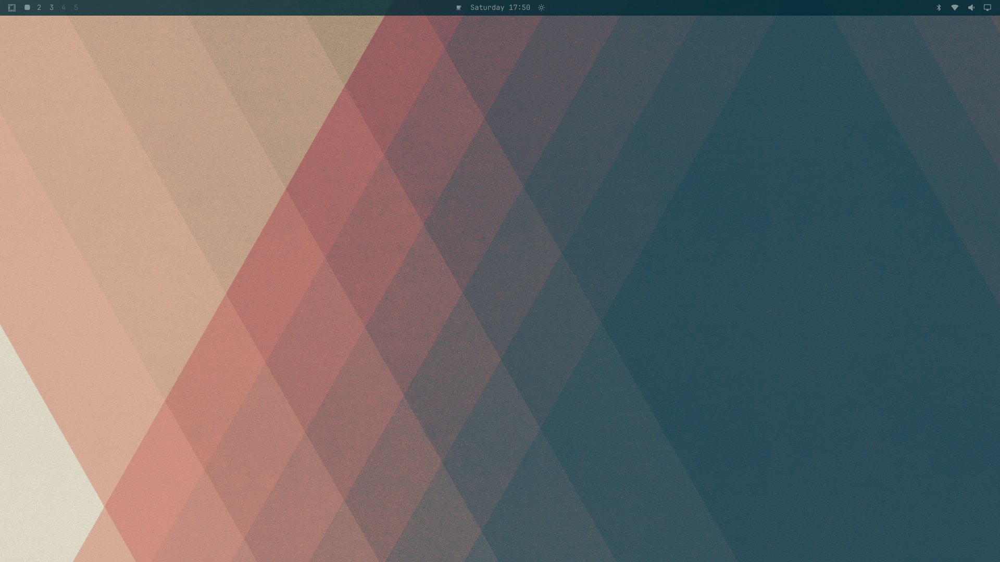

# Solarized Dark (Omarchy theme)

A dark theme for [Omarchy](https://omarchy.org/) based on the
[Solarized](https://ethanschoonover.com/solarized/) color palette by Ethan
Schoonover.



## Install

```bash
omarchy theme install https://github.com/carlop/omarchy-solarized-dark-theme.git
```

Or, to use it without installing from a repo:

```bash
cp -r omarchy-solarized-dark-theme ~/.config/omarchy/themes/solarized-dark
omarchy theme set solarized-dark
```

## Contents

- `colors.toml` — all theme colors mapped from the Solarized Dark palette
- `icons.theme` — icon theme (Yaru-blue)
- `backgrounds/` — drop your background images here
- `preview.png` / `preview-unlock.png` / `unlock.png` — theme preview and lock screen background
- `screenshots/` — screenshots used in this README

When installed from a repo, Omarchy regenerates the executable configs
(`hyprland.lua`, terminal configs, Neovim, VS Code, …) from `colors.toml`
automatically.

## License

MIT. The Solarized color palette is the work of
[Ethan Schoonover](https://ethanschoonover.com/solarized/).
